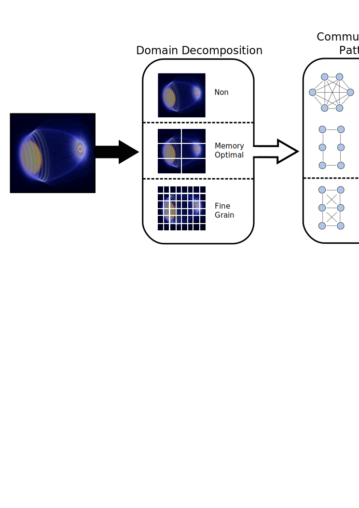

GrayBat
=======

<b>Gr</b>aph <b>A</b>pproach for Highl<b>y</b> Generic Communication Schemes <b>B</b>ased on <b>A</b>daptive <b>T</b>opologies 

##Description##

**GrayBat** is a C++ library that presents a graph-based communication
approach, which enables a mapping of algorithms to communication
patterns and further a mapping of these communication patterns to
hardware topologies. Therefore, a flexible and configurable
communication approach for parallel or distributed applications. These
mappings are established as an intermediate layer between an
application and communication libraries and are adptable dynamically
during run-time.  The [Game of Life](src/gol.cc) and [N
Body](src/nbody.cc) example simulations provide full demonstrations of
utilizing GrayBat in a scientific simulations.

An application supported by GrayBat can be created with the following steps:

1. Decide on how fine grain the application domain should be decomposed
2. Model communication pattern of subdomains as a graph
3. Choose mapping of graph vertices to peers
4. Choose hardware to run the application on

The following figure shows a sketch of the [Game of Life
simulation](src/gol.cc) implemented with GrayBat support.  The Game of
Life domain (20 x 20 cells) is decomposed very fine grain, such that,
every cell is represented by a vertex in a two-dimensional grid and
neighboring vertices are connected by edges. The graph is partioned
into four partitions and mapped to four peers. Therefore, each peer is
responsible for the communication of 100 vertices with its
neighbors. Finally, each two peers are mapped to a quad core processor
on a dual socket system. This is one possible sequence of mappings for a Game of
Life simulation within the GrayBat framework. On each step changes are possible
to adapt the simulation to other architectures, networks or
algorithms.

##Referencing##

GrayBat is a scientific project. If you **present and/or publish** scientific
results that used GrayBat, you should set this as a **reference**.

##Software License##

GrayBat  is licensed under the <b>GPLv3+</b>. Please refer to our [LICENSE.md](LICENSE.md)

##Dependencies##

 * cmake 3.0.2
 * Boost 1.57.0
 * OpenMPI 1.8.0 (for mpi [communication policy](utils/doxygen/communicationPolicy.md))
 * g++ 4.9.2
 * metis 5.1 (for graph partitioning)

##Compiling##

 * clone the repository: `git clone https://github.com/computationalradiationphysics/graybat.git`
 * create the build directory: `mkdir -p GrayBat/build`
 * go to build directory: `cd GrayBat/build`
 * set compiler: `export CXX=[g++,clang++]`
 * create Makefile `cmake ..`
 * build project : `make [target]`

##Tested Compilers##

 * clang 3.5
 * g++ 4.9.2

### Current Compilation Status:

| *branch* | *state* | *description* |
| -------- | --------| ------------- |
| **master** |  |  stable releases |
| **dev**  |  |development branch |

##Example Targets##

GrayBat is a library, but some examples are provided to demonstrate
its usage. All targets provide the synoptsis of their executables.

 * GoL: Game of Life simulation

 * NBody: N Body simulation

 * doc: Build documentation in ../doc/

 * clean: Cleanup build directory

##Authors##

 * Erik Zenker (erikzenker@posteo.de)
